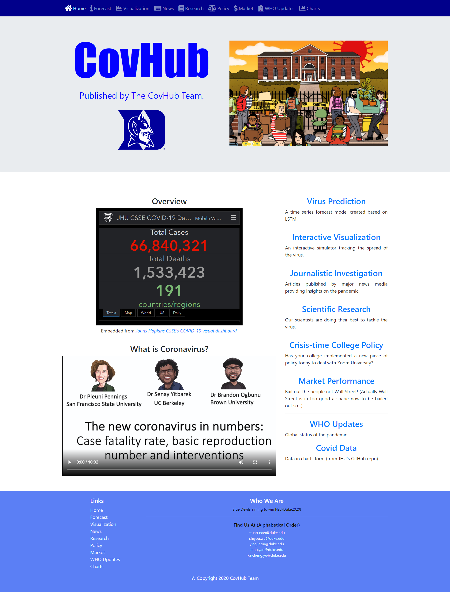
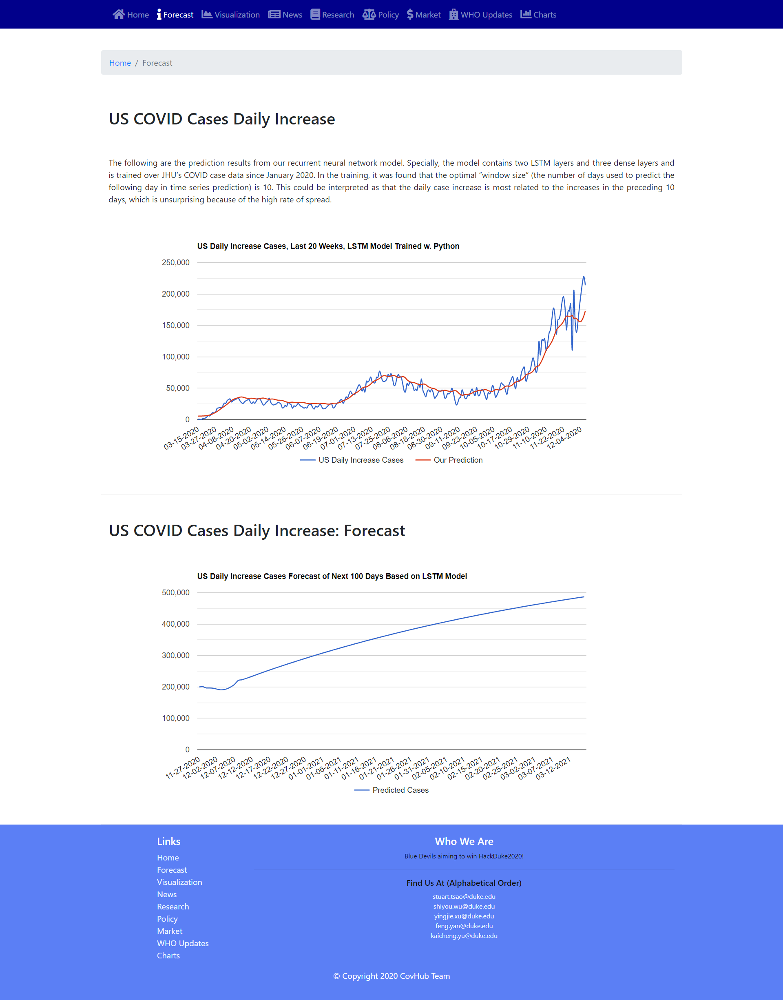
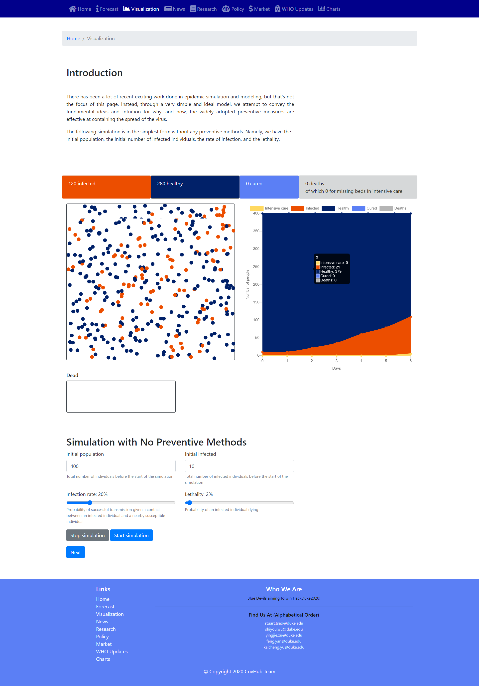
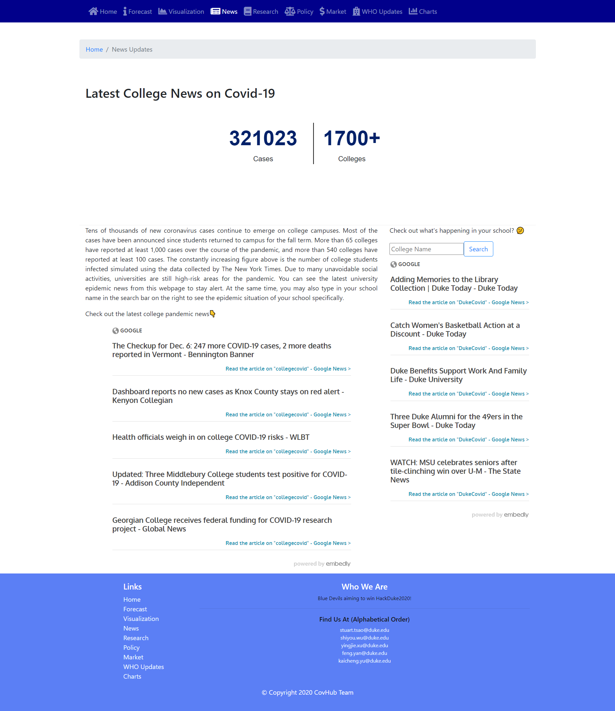
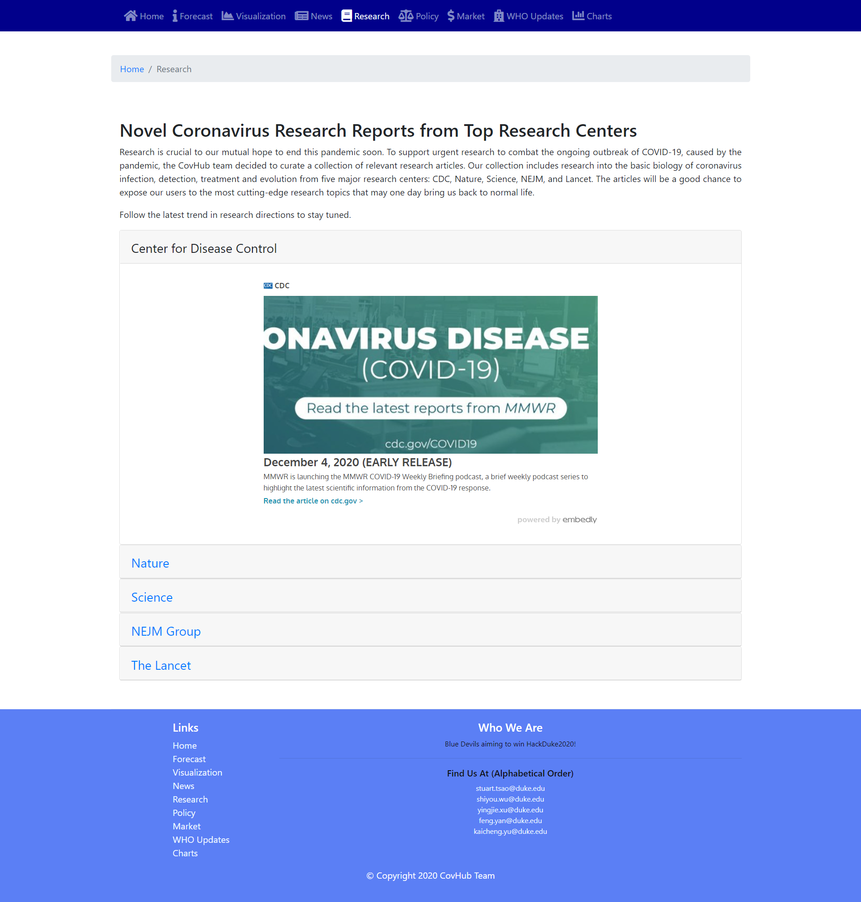
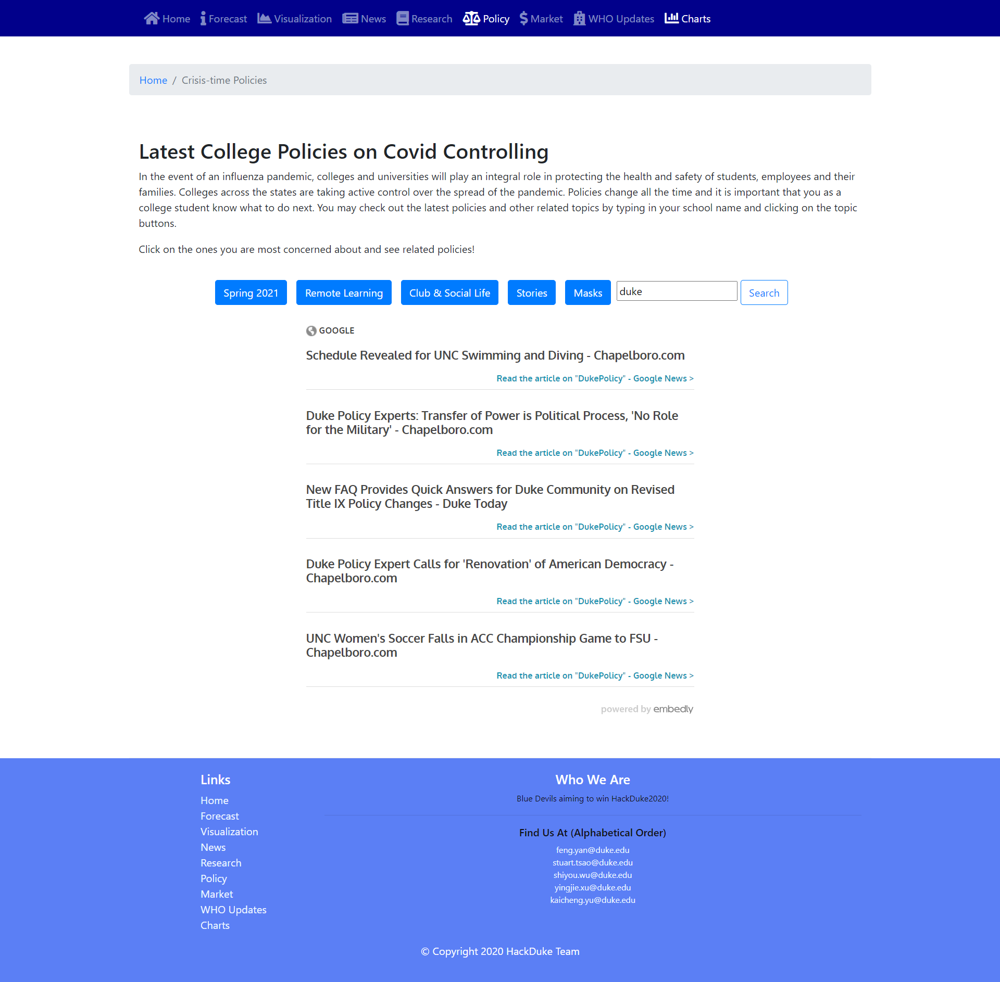
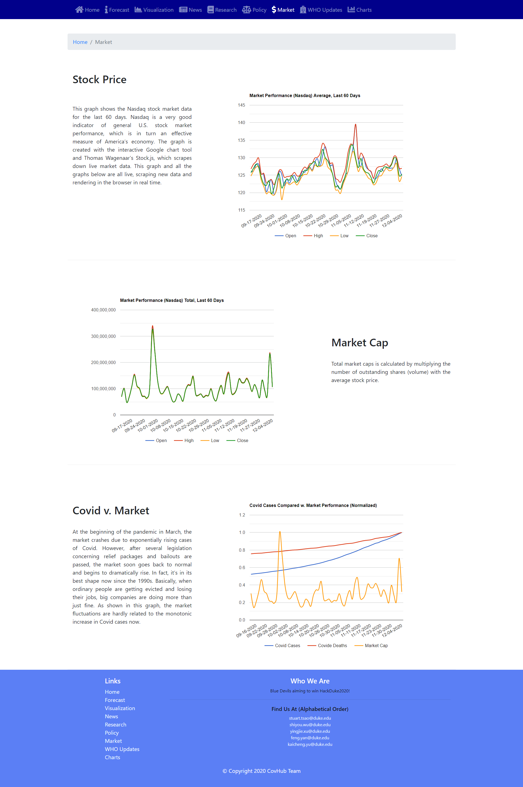
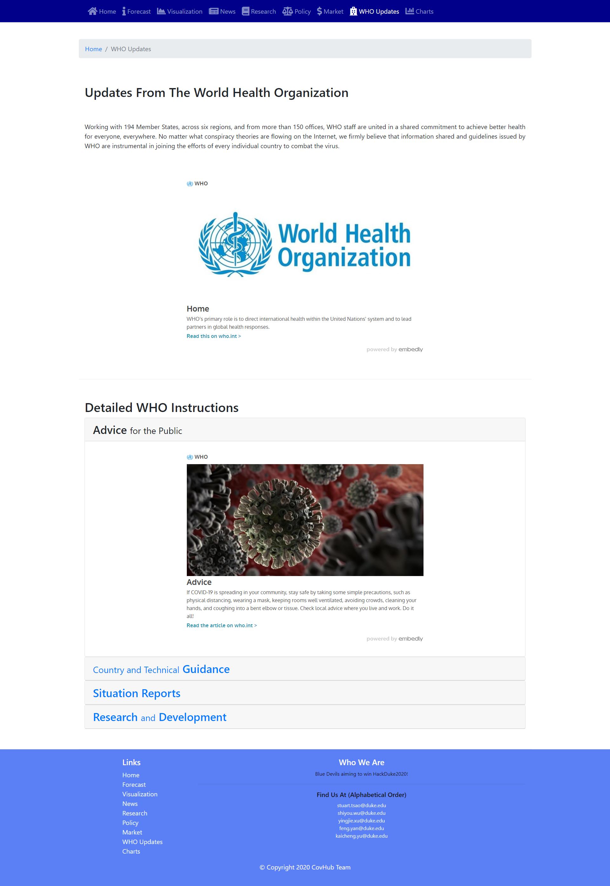
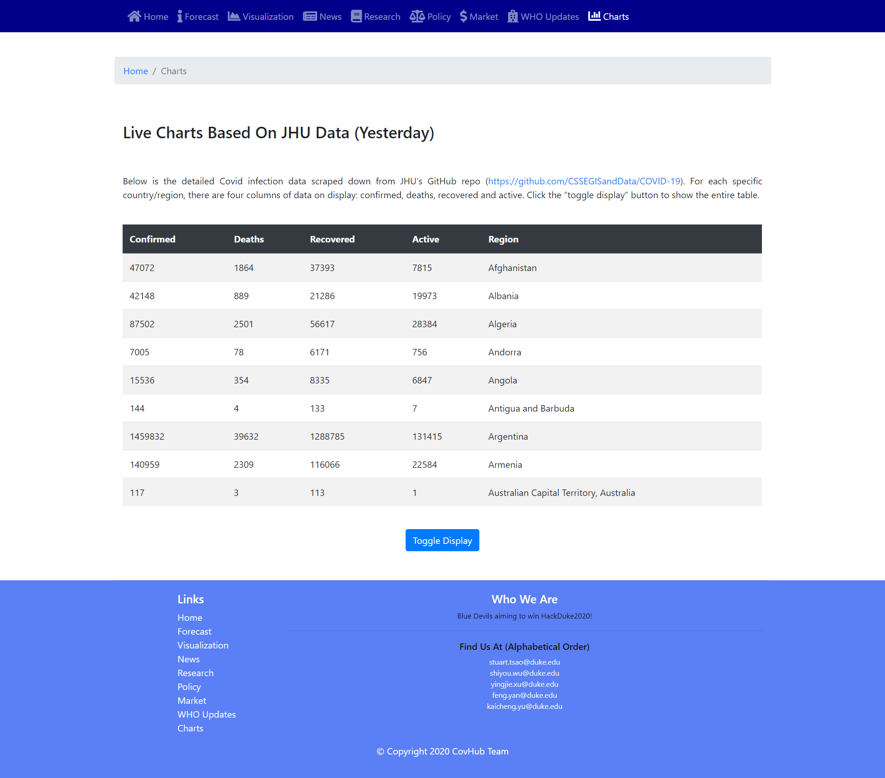

# hackduke2020.github.io 
by *The CovHub Team*

Welcome to our repository for our HackDuke2020 project! We’ve created a website that contains a broad range of information about the COVID-19, including latest updates, forecast for daily new cases, interactive visualization, and more. Check it out at https://hackduke2020.github.io/

Frameworks: tensorflow.js, Bootstrap, JQuery, stocks.js, Google Chart, Embed.ly, https://github.com/LucaDiba/epidemic-simulator

## About the Project

### Inspiration
In the current context, college communities are especially susceptible to COVID outbreaks, which can be attributed to the interactive teaching/learning modes and the small and occasional social gatherings. To create a safer environment for college students, faculties, and their families in this unprecedented time, we felt highly motivated, as college freshmen ourselves, to develop a tool that helps college students stay well-informed about what they’re facing on and off campus.

Our initial idea for the project came from the YouTube video “Simulating an epidemic” by 3Blue1Brown, who is famous for his mathematical visualizations. In the video, he presented a simple yet effective model that abstracts away the key ideas of disease spread without going into the sometimes more cumbersome details. Thus, in a time where information can be highly scattered, the main focus for our website is to deliver the relevant connections in a timely and organized manner such that the users don’t have to concern themselves with the labour of finding and organizing such themselves. In this sense, our website makes it easier for college students to not only access relevant information, but also observe the key connections that would serve them in their everyday decision making. 

### Overview: Features and Functionalities

Our website is divided into eight main sections, each of which presents a central topic relevant to COVID-19. 

- On the landing page, we have embedded an overview of current case counts, an informational video about the coronavirus, and links to all the sections. 

- The first section presents a time series forecast for the upcoming trend of daily new cases in the United States using a neural network model involving LSTM. Looking at the graphs, the users can have a rough sense of how everything may turn out in the upcoming weeks. 

- In the next section, we have included the aforementioned simulations, which is splitted into different subsections for illustration purposes. Under each subsection, the user is able to enter his or her own parameters and observe the effects on the simulated results. Using this approach, we feel that the users can understand the intuitive benefits of preventive measures such as quarantines and the effectiveness of flattening the curve when hospitals have limited capacities for intensive care units.  

- The next section is related to COVID-19 news. Here, we tailored the news to be relevant for college students, and we also included a search function for users to find news related to any specific college.  
  
- In a similar manner, the next three sections provide relevant updates on research, school-specific policies, and market updates. For people interested in these topics, our hope is that the information they find here is relevant and concise.    
  
- The last two sections are for updated information from WHO and newest COVID-19 data from Johns Hopkins University, respectively. We have intentionally included them so that users could instantly access those crucial information sources and, if they wish to, delve deeper into a wide source of covid-related data. 
    

### The Journey: What worked, What didn’t, and What we learned

We have achieved all the features we initially planned, which are described in the section above. 

One challenge we ran into was that, while building the covid case forecasting model, we could not achieve accurate prediction. Even after we spent many hours tuning an LSTM neural network that predicts the cumulative number of cases, its performance was always unsatisfactory during November and December 2020, possibly due to the huge surge in the data during that time. We then reevaluated the covid case data and decided to switch to training an tfjs LSTM neural network model (converted from a pre-trained python model) that predicts daily case increase instead, which has less variance. It turned out to be a right decision, and we were able to achieve much better accuracy of prediction. 

### What’s Next
While our website has already incorporated a broad range of informative features, we believe some features can be further improved. For instance, in the simulation visualization, we could add parameters such as the number of centralized locations within the community (e.g. malls) and the community’s county, which would also impact how the virus spread. In the covid case forecast page, we plan to adopt state-of-the-art models from recent researches to yield more accurate results, thus presenting a more reliable forecast to our users. Meanwhile, we would be collecting feedback from users and accordingly polish the existing features on our website. 
